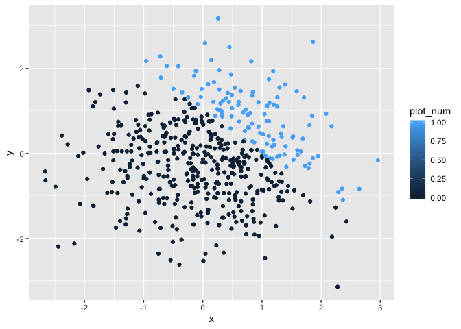
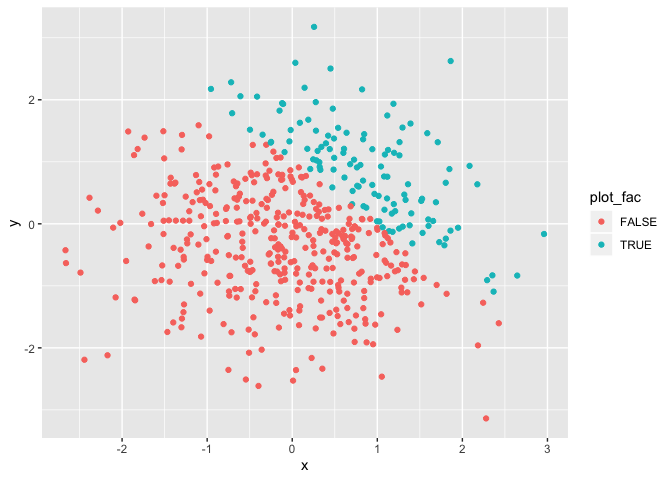

p8105\_hw1\_ys3298
================
Yimeng SHANG
9/12/2019

# 1.1

``` r
#setup dataframe
library(tidyverse)
```

    ## ── Attaching packages ────────────────────────────────────────────────────── tidyverse 1.2.1 ──

    ## ✔ ggplot2 3.2.1     ✔ purrr   0.3.2
    ## ✔ tibble  2.1.3     ✔ dplyr   0.8.3
    ## ✔ tidyr   0.8.3     ✔ stringr 1.4.0
    ## ✔ readr   1.3.1     ✔ forcats 0.4.0

    ## ── Conflicts ───────────────────────────────────────────────────────── tidyverse_conflicts() ──
    ## ✖ dplyr::filter() masks stats::filter()
    ## ✖ dplyr::lag()    masks stats::lag()

``` r
df = tibble(
  norm_distri = rnorm(8, 0, 1),
  vec_logi = norm_distri > 0,
  vec_char = c("1", "2", "3", "4", "5", "6", "7", "8"),
  vec_fac = factor(c("1", "2", "1", "1", "1", "1", "2","2"))
)

#Take the mean of each data types in df
#The mean of character vector and factor vector do not work.
mean(df$norm_distri)
mean(df$vec_logi)
mean(df$vec_char)
```

    ## Warning in mean.default(df$vec_char): argument is not numeric or logical:
    ## returning NA

``` r
mean(df$vec_fac)
```

    ## Warning in mean.default(df$vec_fac): argument is not numeric or logical:
    ## returning NA

``` r
#make numeric
num_logi = as.numeric(df$vec_logi)
num_char = as.numeric(df$vec_char)
num_fac = as.numeric(df$vec_fac)
```

# 1.2

``` r
#convert the logical vector to numeric, and multiply the random sample by the result
num_logi = as.numeric(df$vec_logi)
product_logi_num = num_logi * df$norm_distri

#convert the logical vector to a factor, and multiply the random sample by the result
fac_logi = as.factor(df$vec_logi)
product_logi_fac = fac_logi * df$norm_distri
```

    ## Warning in Ops.factor(fac_logi, df$norm_distri): '*' not meaningful for
    ## factors

``` r
#‘*’ not meaningful for factors

#convert the logical vector to a factor and then convert the result to numeric, and multiply the random sample by the result
num_logi_fact = as.numeric(as.factor(df$vec_logi))
product_num_logi_fac = num_logi_fact * df$norm_distri
```

# 2.1

``` r
#setup new dataframe for plot
plotdata = tibble(
  x = rnorm(500, 0, 1),
  y = rnorm(500, 0, 1),
  plot_logi = x + y > 1,
  plot_num = as.numeric(plot_logi),
  plot_fac = as.factor(plot_logi)
)
```

# 2.2

  - The row of the plotdata is : 500
  - The column of the plotdata is : 5
  - The mean of x : 0.0275958
  - The median of x : 0.0307464
  - The standard deviation of x : 0.9895401
  - The proportion of cases for which x + y \> 1 is :
0.256

# 2.3 + 2.4

``` r
ggplot(plot1, data = plotdata, mapping = aes(x = x, y = y, color = plot_logi)) + geom_point()
```

<!-- -->

``` r
ggplot(plot2, data = plotdata, mapping = aes(x = x, y = y, color = plot_num)) + geom_point()
```

<!-- -->

``` r
ggplot(plot3, data = plotdata, mapping = aes(x = x, y = y, color = plot_fac)) + geom_point()
```

<!-- -->

``` r
ggsave("plot1.png")
```

    ## Saving 7 x 5 in image
